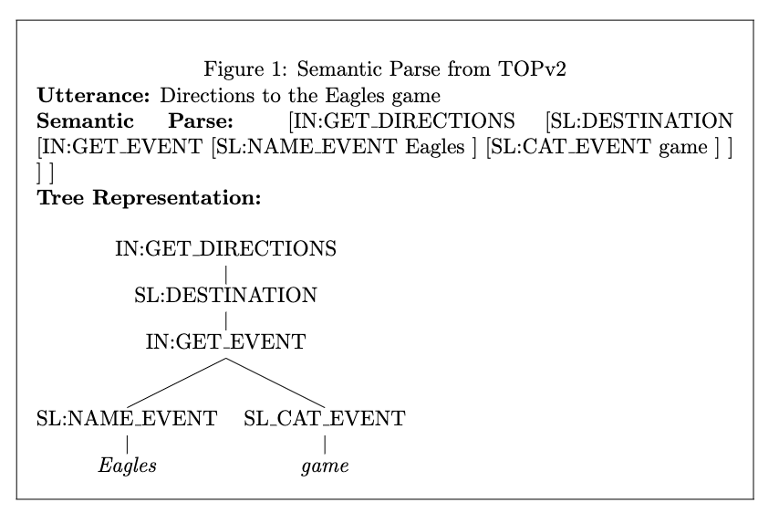
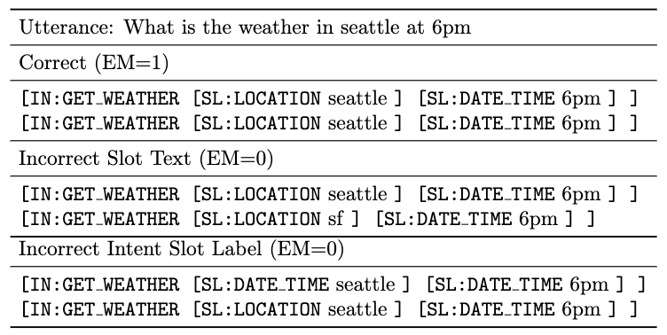

| [Call For Participation](call_for_participation.md) | [SLU & STOP Dataset](semantic_parsing.md) | [Challenge Tracks](challenge_tracks.md) | [Rules](rules.md) | [Getting Started](getting_started.md) | [Contact US](contact_us.md)|
|------------------------|--------------------|------------------|-------|-----------------|------------|

# Semantic Parsing and the STOP Dataset

## What is semantic parsing and the annotation format?

Semantic parsing is the task of converting a user’s request into a structured format for executing tasks. Examples are given in the table below from the STOP dataset. Each parse consists of 2 key components: Intent and Slot.  As an example consider `“what is the weather in seattle”`
* **Intent:** Intention of a user based on predefined intent labels (`intent = get weather`)
* **Slot:** Slots correspond to relevant arguments for each intent (`slot = {location: weather}`)

* **Compositionality:** As queries continue to grow more complex, intent and slot filling as a flat structure no longer suffices. Consider “Directions to the Eagles Game” in order to parse this example, our meaning representation encompasses nested intents and slots. An example is depicted in the figure below where This query can be phrased with nested intents and slots to provide a granular definition of the users intent.



## Task Definition

Concretely in this task, you are asked to produce the semantic parse as a linearized tree structure (Output in the table below), given an audio sample (input in the table below). Our baseline system [1] proposes this as a sequence-to-sequence task leveraging HuBERT [4] and Wav2Vec 2.0 [5] as the underlying encoder representations with a transformer decoder. 

| Input                                | Output                                                                                              |
|--------------------------------------|-----------------------------------------------------------------------------------------------------|
| Audio: Directions to the Eagles Game | [IN:GET_DIRECTIONS [SL:DESTINATION [IN:GET_EVENT [SL:NAME_EVENT Eagles ] [SL:CAT_EVENT game ] ] ] ] |

## Metrics

**Exact Match**: We compute the exact match of the predicted output and the annotated parse in the dataset comparing the intent/slot labels as well as leaf slot text. 



In the examples above we show examples of correct and incorrect semantic parses for the utterance ``what is the weather in seattle at 6pm''. The first example is correct because the two parses match exactly in output. The second parse is incorrect because the slot text (seattle vs sf) is different. The third parse is incorrect because seattle was incorrectly labeled as a date time.

## STOP Dataset

### Dataset Statistics

The STOP (spoken task oriented parsing) dataset is the largest most semantically complex end-to-end spoken language dataset. It contains over 200000 audio files from over 800 different speakers. The text utterances and semantic parses are taken from TOPv2 [2] which contains 125K unique utterance parse pairs, across 8 different domains, alarm, event, messaging, music, navigation, reminder, timer and weather. Crowd workers were requested to record themselves speaking each utterance through Amazon's Mechanical Turk. Two audio recordings were taken of every utterance in the validation and test set, and one for each utterance in the train set. The semantic parse may contain nested intents or in other words compositional queries.

### Low Resource Splits

Along with the overall dataset, the STOP dataset supplies additional dataset splits for low-resource learning. Specifically, the STOP dataset provides low-resource train and validation sets for the “reminder” and “weather” domains, each with 25 Samples Per Intent-Slot (SPIS) [2]. The construction of these low-resource sets ensures that each intent and slot type is present in the low-resource train set in at least 25 samples. The reminder and weather train sets have 480 and 162 samples, respectively, and their validation sets have 328 and 139 samples, respectively.

### LICENSE
The license for the dataset can be found here: https://dl.fbaipublicfiles.com/stop/LICENSE.txt 


## Citation

```
@inproceedings{stop2022,
  author    = {Paden Tomasello and Akshat Shrivastava and Daniel Lazar and Po-Chun Hsu and Duc Le and Adithya Sagar and Ali Elkahky and Jade Copet and Wei-Ning Hsu and Yossef Mordechay and Robin Algayres and Tu Anh Nguyen and Emmanuel Dupoux and Luke Zettlemoyer and Abdelrahman Mohamed},
  title     = {{STOP: A dataset for Spoken Task Oriented Semantic Parsing}},
  booktitle   = {CoRR},
  eprinttype = {arXiv},
}
```


# References

[1] Tomasello, P., A. Shrivastava, D. Lazar, P. chun Hsu, D. Le, A. Sagar, A. M. Elkahky, J. Copet, W.-N. Hsu, Y. Mordechay, R. Algayres, T. Nguyen, E. Dupoux, L. Zettlemoyer, and A. rahman Mohamed (2022). Stop: A dataset for spoken task oriented semantic parsing. ArXiv abs/2207.10643

[[2207.10643] STOP: A dataset for Spoken Task Oriented Semantic Parsing](https://arxiv.org/abs/2207.10643?context=cs)

[2] Chen, X., A. Ghoshal, Y. Mehdad, L. Zettlemoyer, and S. Gupta (2020). Low-resource domain adaptation for compositional task-oriented semantic parsing. CoRR abs/2010.03546.

[[2010.03546] Low-Resource Domain Adaptation for Compositional Task-Oriented Semantic Parsing](https://arxiv.org/abs/2010.03546)

[3] Le, D., A. Shrivastava, P. Tomasello, S. Kim, A. Livshits, O. Kalinli, and M. L. Seltzer (2022). Deliberation model for on-device spoken language understanding. In INTERSPEECH.

[[2204.01893] Deliberation Model for On-Device Spoken Language Understanding](https://arxiv.org/abs/2204.01893)

[4] Hsu, W., B. Bolte, Y. H. Tsai, K. Lakhotia, R. Salakhutdinov, and A. Mohamed (2021). Hubert: Self-supervised speech representation learning by masked prediction of hidden units. CoRR abs/2106.07447.

[[2106.07447] HuBERT: Self-Supervised Speech Representation Learning by Masked Prediction of Hidden Units](https://arxiv.org/abs/2106.07447)

[5] Baevski, A., H. Zhou, A. Mohamed, and M. Auli (2020). wav2vec2.0: A framework for self-supervised learning of speech representations. CoRR abs/2006.11477.

[[2006.11477] wav2vec 2.0: A Framework for Self-Supervised Learning of Speech Representations](https://arxiv.org/abs/2006.11477)